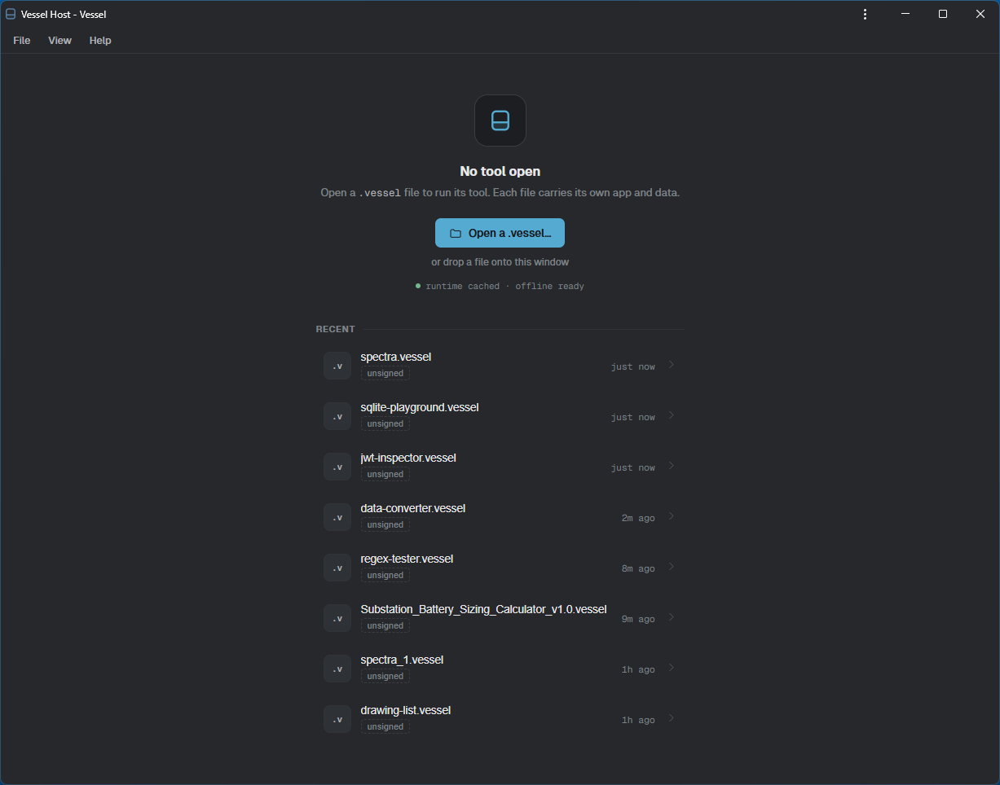
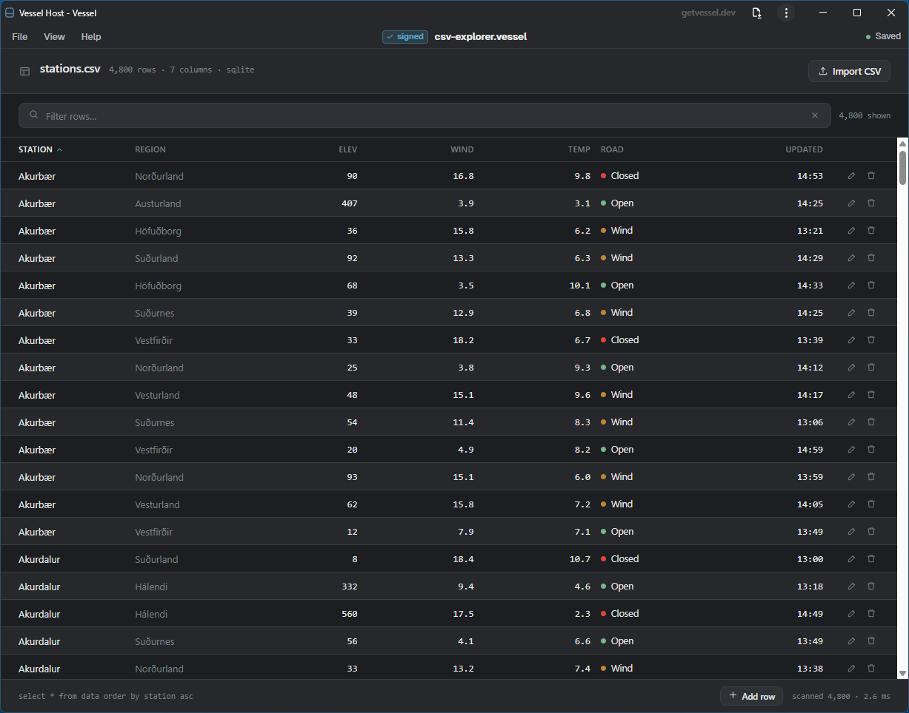
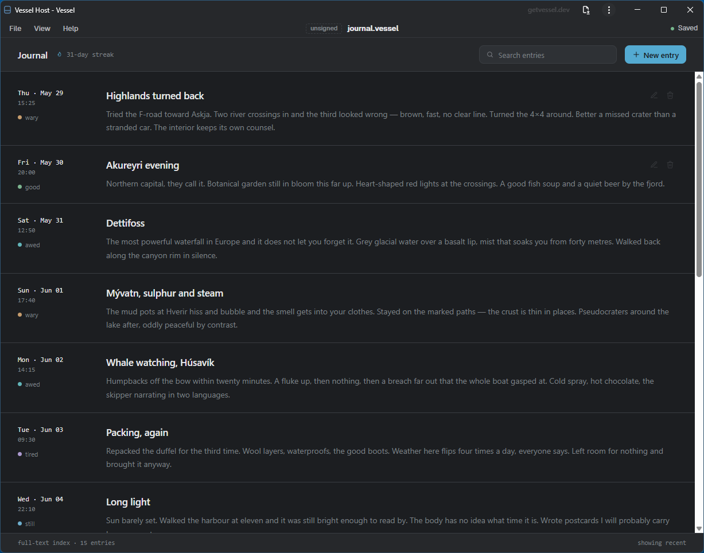
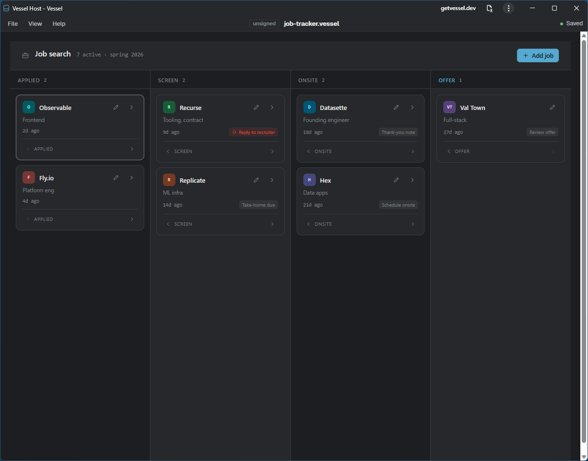
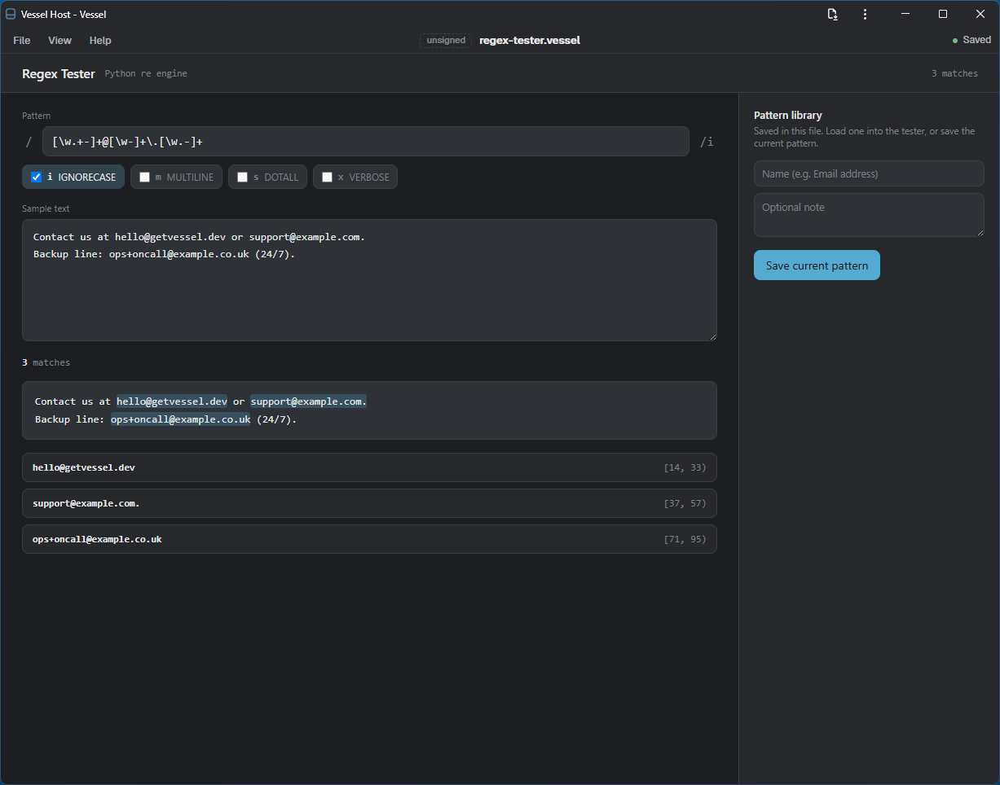

# Vessel

**The artifact format for AI-generated software.** Describe a tool, and the model
hands you one self-contained file — UI, logic, and data inside — that runs the
instant you open it, with nothing to deploy or operate.

Concretely: an installable runtime **host** that opens self-contained `.vessel`
web-tool bundles — a React UI + a Python/FastAPI backend + a SQLite database, with
the data living *inside the file*. The spreadsheet model (an installed engine + a
portable zipped document) for modern web tools.

Install the host once (as a PWA); after that any `.vessel` opens, runs, and saves
its data back to the same file — no server, no accounts, everything in the
browser.

**Try it:** [getvessel.dev](https://getvessel.dev) — the host installs from
[getvessel.dev/app/](https://getvessel.dev/app/).

## Screenshots
The host — your installed launcher — and a few `.vessel` tools running inside it:

| | |
|---|---|
|  |  |
|  |  |

More on the [landing page](https://getvessel.dev/#screenshots).

## Quick start
See [`docs/setup.md`](docs/setup.md).

## Documentation
- [`docs/design.md`](docs/design.md) — the full design: architecture, bundle format, bridge contract, security model
- [`docs/architecture.md`](docs/architecture.md) — components and how the pieces fit
- [`docs/format.md`](docs/format.md) — the `.vessel` bundle format + `manifest.json`
- [`docs/sdk.md`](docs/sdk.md) — authoring bundles with the `vessel` CLI
- [`docs/setup.md`](docs/setup.md) — running from a fresh clone
- [`docs/operations.md`](docs/operations.md) — releasing the host and SDK

## Status
Pre-1.0. **Chromium** gives the full experience (double-click open + promptless
save); **Firefox/Safari** run degraded (in-app open + download-to-save). Opening
a `.vessel` is designed to be no more dangerous than opening a web page —
sandboxed UI, WASM-sandboxed Python, default-deny network egress.

## License
[Apache-2.0](LICENSE).
